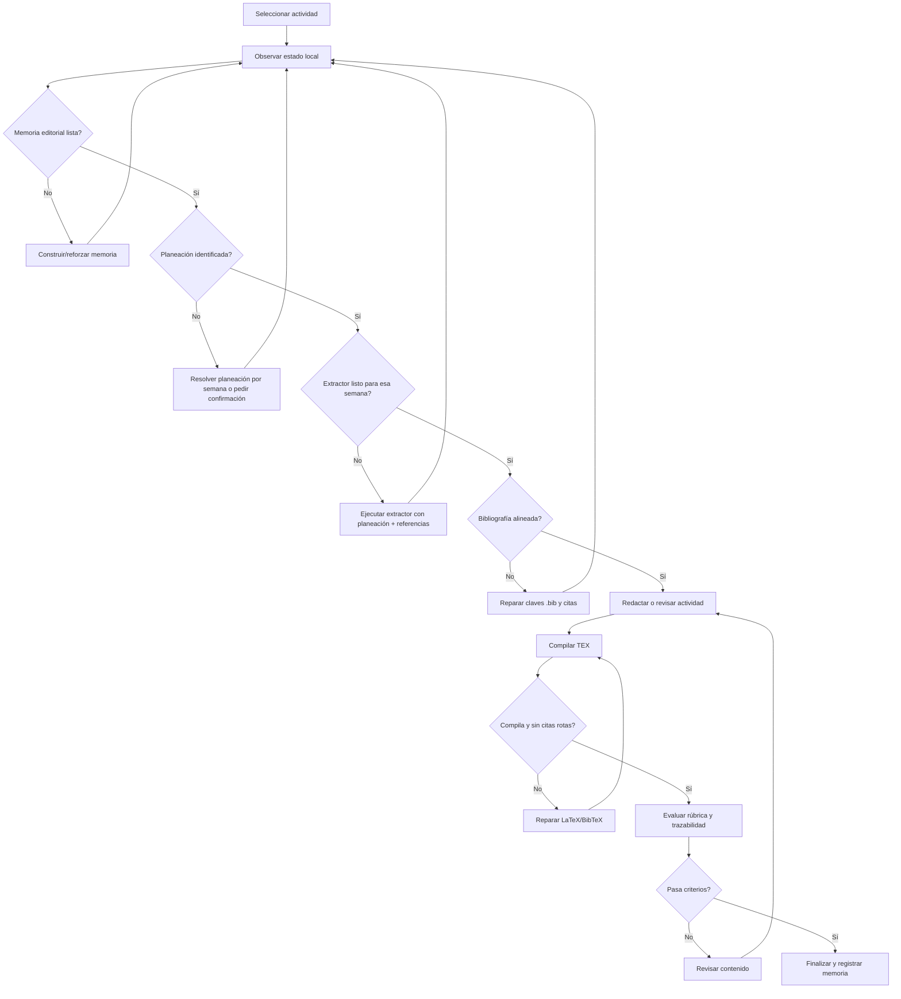

# Flujo agentico propuesto para Filosofía del Derecho

## 1. Diagnóstico local

La materia `Filosofía del Derecho` ya tiene una base madura para operar con un flujo de verdadero agente en AulaTeX.

Ruta principal:

```text
UnADM/licenciatura-en-derecho-unadm/filosofia-del-derecho-lde/
```

Artefactos existentes:

- Reporte base: `reporte-filosofia-del-derecho.tex`.
- Actividades realizadas: `reporte-filosofia-del-derecho-Actividad-1.tex` a `Actividad-6.tex`.
- PDFs ya generados para las seis actividades.
- Presentación base y presentación de Actividad 6.
- Programa analítico: `programa-analitico-filosofia-del-derecho.md`.
- Planeaciones semanales: `planeaciones-filosofia-del-derecho/`.
- Referencias por tarea: `referencias-filosofia-del-derecho/`.
- Bibliografía canónica: `filosofia-del-derecho.bib`.
- Bibliografía depurada auxiliar: `filosofia-del-derecho-clean.bib`.
- Memoria editorial por materia y por actividades 1 a 6.
- Salida previa del extractor para Semana 3 en `referencias-filosofia-del-derecho/conceptos-filosofia-del-derecho-S03/`.

## 2. Lectura de actividades

| Actividad | Archivo | Semana | Producto detectado | Estado observable |
| --- | --- | --- | --- | --- |
| 1 | `reporte-filosofia-del-derecho-Actividad-1.tex` | Semana 2 | Mapa conceptual sobre Filosofía del Derecho | Tiene PDF, pero usa claves de cita antiguas no presentes en el `.bib` canónico actual. |
| 2 | `reporte-filosofia-del-derecho-Actividad-2.tex` | Semana 3 | Cuadro comparativo entre Derecho Natural y Positivismo Jurídico | Tiene citas alineadas con `.bib`; existe salida del extractor para S03. |
| 3 | `reporte-filosofia-del-derecho-Actividad-3.tex` | Semanas 4 y 5 | Glosario y análisis de caso | Citas alineadas; buen patrón de glosario + caso. |
| 4 | `reporte-filosofia-del-derecho-Actividad-4.tex` | Semana 6 | Estudio de caso: Poder, Estado y Derecho | Citas alineadas; usa estudio de caso y ejemplos constitucionales. |
| 5 | `reporte-filosofia-del-derecho-Actividad-5.tex` | Semana 7 probable | Interpretación jurídica, hermenéutica y argumentación | Citas alineadas, pero conserva una marca activa de pendiente o placeholder. |
| 6 | `reporte-filosofia-del-derecho-Actividad-6.tex` | Semana 8 probable | Caso Ayotzinapa, derecho, moral y dignidad humana | Citas alineadas, pero conserva una marca activa de pendiente o placeholder. |

## 3. Hallazgos de bibliografía y referencias

### Bibliografía canónica

El archivo operativo debe ser:

```text
filosofia-del-derecho.bib
```

Contiene fuentes doctrinales, normativas, jurisprudenciales y periodísticas útiles para las actividades.

Ejemplos de claves útiles:

- `finnisEstudiosTeoriaDerecho2017`
- `ruizrodriguezFilosofiaDerecho2009`
- `rojas-gonzalezFilosofiaDerecho2018`
- `lovonManualPracticoFilosofia2020`
- `garciaMaynez2002`
- `launDerechoMoral2021`
- `kelsen1982`
- `cpeum2026`
- `LeyGeneralVictimas`
- `scjnMatrimonio2015`
- `scjnViolenciaFisica2022`
- `scjnIncapacidadResistencia2019`
- `casoAyotzinapaCNDH2024`

### Deuda bibliográfica

La Actividad 1 cita claves antiguas con guion bajo que ya no coinciden con el `.bib` canónico actual:

- `de_victimas_ley_2013`
- `finnis_estudios_2017`
- `franzoni_acevedo_ley_2017`
- `gandara_ley_2015`
- `generales_ley_2021`
- `lovon_manual_2020`
- `noauthor_constitucion_nodate`
- `rojas_gonzalez_filosofia_derecho_2018`
- `ruiz_rodriguez_filosofia_derecho_2009`

Esto no significa que falten necesariamente las fuentes, sino que hay una desalineación de claves entre versión antigua de actividad y `.bib` actual. Un agente debe reparar claves antes de evaluar calidad final.

### Bibliografía auxiliar

`filosofia-del-derecho-clean.bib` parece útil para interpretación jurídica, especialmente actividades cercanas a Semana 7, pero la memoria editorial ya advierte que no debe asumirse como canon global sin validación.

Regla propuesta:

- `filosofia-del-derecho.bib` = canónico.
- `filosofia-del-derecho-clean.bib` = auxiliar depurado, importable parcialmente si una actividad lo necesita.

## 4. Planeaciones

La carpeta de planeaciones contiene semanas S2 a S8:

```text
planeaciones-filosofia-del-derecho/
  Planificación de actividades S2 - Filosofía del Derecho.pdf
  Planificación de actividades S3 - Filosofía del Derecho.pdf
  Planificación de actividades S4 - Filosofía del Derecho.pdf
  Planificación de Actividades S5 - Filosofía del Derecho.pdf
  Planificación de Actividades S6 - Filosofía del Derecho.pdf
  Planificación de Actividades S7 - Filosofía del Derecho.pdf
  Planificacion de Actividades S8 - Filosofia del Derecho.pdf
```

El extractor ya procesó al menos Semana 3 y produjo:

```text
referencias-filosofia-del-derecho/conceptos-filosofia-del-derecho-S03/
  resumen_planeacion.json
  conceptos_detectados.json
  ideas_detectadas.json
  fichas_conceptos.*
  trazabilidad_fuentes.json
```

La salida S03 es especialmente útil para Actividad 2, porque detecta conceptos como:

- Derecho Natural
- Positivismo Jurídico
- Jerarquía Normativa
- Filosofía del Derecho
- Interpretación jurídica
- Sistema jurídico

## 5. Estado de memoria editorial

AulaTeX ya posee memoria editorial consolidada para:

- materia completa;
- actividades 1 a 6.

Patrón editorial recurrente:

1. Problema jurídico o social.
2. Conceptos, normas o doctrina.
3. Producto solicitado por planeación.
4. Análisis propio.
5. Conclusión jurídica transferible.

Reglas fuertes de la memoria:

- conservar identidad UnADM;
- no copiar contenido exclusivo entre actividades;
- transferir solo patrones reutilizables;
- no propagar salidas no estructuradas sin normalización;
- mantener trazabilidad entre consigna, `.tex`, `.bib` y evidencia;
- marcar supuestos cuando falte consigna local.

## 6. Flujo agentico recomendado

El flujo debe operar por actividad, no solo por materia.



## 7. Roles de agentes

### 1. Agente de memoria

Responsabilidad:

- leer memoria de materia y actividad;
- detectar reglas reutilizables;
- evitar transferencia literal entre actividades;
- producir contexto editorial comprimido.

Herramientas AulaTeX:

- `editorial-memory`
- `EditorialMemoryStore`

### 2. Agente de planeación

Responsabilidad:

- identificar la planeación correcta según actividad/semana;
- extraer objetivo, producto, técnica didáctica, rúbrica y bibliografía sugerida;
- decidir si la consigna es suficiente o requiere confirmación humana.

Herramientas:

- parser local del extractor;
- `resumen_planeacion.json` cuando exista;
- PDFs de `planeaciones-filosofia-del-derecho/`.

### 3. Agente extractor

Responsabilidad:

- ejecutar extractor por actividad/semana;
- producir fichas, conceptos, ideas y trazabilidad;
- validar si las fichas tienen calidad suficiente.

Herramientas:

- `ExtractorAdapter`
- `scripts/aulatex.ps1 extractor`

Salida esperada por actividad:

```text
extractor-aulatex/actividad-XX/
  resumen_planeacion.json
  conceptos_detectados.json
  ideas_detectadas.json
  fichas_conceptos.md
  fichas_conceptos.json
  trazabilidad_fuentes.json
```

### 4. Agente bibliográfico

Responsabilidad:

- comparar claves citadas en `.tex` contra `filosofia-del-derecho.bib`;
- detectar claves antiguas, duplicadas o auxiliares;
- proponer migración de claves;
- decidir cuándo importar desde `filosofia-del-derecho-clean.bib`.

Evaluadores automáticos:

- toda `\citep{}` o `\citet{}` debe existir en `.bib`;
- no debe haber claves de ejemplo como `clave`, `clave1`, `clave2` en texto activo;
- no se debe usar `clean.bib` como canon sin justificación.

### 5. Agente redactor

Responsabilidad:

- tomar planeación + fichas + memoria;
- redactar o revisar actividad;
- mantener estructura argumentativa y cierre jurídico propio;
- no inventar fuentes.

Entrada mínima:

- `resumen_planeacion.json`
- `fichas_conceptos.json`
- `trazabilidad_fuentes.json`
- `.bib` canónico
- memoria de actividad

### 6. Agente compilador

Responsabilidad:

- ejecutar `latexmk-build.ps1`;
- detectar errores de BibTeX, claves faltantes, paquetes, rutas e imágenes;
- producir log normalizado.

### 7. Agente evaluador

Responsabilidad:

- comparar resultado contra criterios de planeación;
- revisar trazabilidad, estructura, citas, pendientes y PDF;
- decidir si se finaliza o se vuelve a redactar/reparar.

## 8. Evaluadores concretos para Filosofía del Derecho

### Evaluador de memoria

Pasa si:

- existe memoria de materia;
- existe memoria de actividad o se puede heredar de materia;
- no hay salidas no estructuradas sin normalizar en la memoria usada.

### Evaluador de planeación

Pasa si:

- la actividad tiene planeación semanal identificada;
- se extrajo técnica didáctica;
- se extrajo producto esperado;
- se extrajeron criterios de entrega.

### Evaluador de extractor

Pasa si existen:

- `resumen_planeacion.json`
- `conceptos_detectados.json`
- `ideas_detectadas.json`
- `fichas_conceptos.json`
- `trazabilidad_fuentes.json`

Y si:

- hay al menos 8 conceptos;
- hay al menos 5 ideas con fuente;
- al menos 70% de conceptos tienen citas de calidad media o alta.

### Evaluador bibliográfico

Pasa si:

- todas las claves citadas activas existen en `filosofia-del-derecho.bib`;
- no hay claves ejemplo en texto activo;
- no hay entradas truncadas críticas;
- las fuentes normativas están actualizadas o marcadas como vigentes.

Caso detectado:

- Actividad 1 debe fallar hasta migrar sus claves antiguas.

### Evaluador de redacción

Pasa si:

- no hay `\pendiente{}` activo;
- no hay `PENDIENTE` ni `TODO` activo;
- contiene introducción, desarrollo, conclusión y bibliografía;
- el cierre contiene postura jurídica propia.

Casos detectados:

- Actividades 5 y 6 requieren revisión por marcas pendientes activas.

### Evaluador de compilación

Pasa si:

- `latexmk-build.ps1` devuelve código 0;
- no hay claves BibTeX faltantes;
- no hay `??` en referencias;
- el PDF se genera en la carpeta de la materia.

## 9. Flujo por actividad

### Actividad 1

Prioridad:

1. Reparar claves bibliográficas antiguas.
2. Revalidar con `.bib` canónico.
3. Ejecutar extractor sobre planeación S2 si no hay fichas específicas.
4. Evaluar si el mapa conceptual conserva trazabilidad.

### Actividad 2

Prioridad:

1. Reutilizar salida S03 existente.
2. Verificar que el cuadro comparativo esté alineado con `resumen_planeacion.json`.
3. Compilar y evaluar.

### Actividad 3

Prioridad:

1. Extraer o validar planeaciones S4-S5.
2. Validar glosario + caso.
3. Revisar que cada concepto tenga cita o fuente.

### Actividad 4

Prioridad:

1. Validar planeación S6.
2. Confirmar estudio de caso local.
3. Revisar mezcla de fuentes doctrinales, constitucionales y periodísticas.

### Actividad 5

Prioridad:

1. Resolver marca activa de pendiente.
2. Decidir si `filosofia-del-derecho-clean.bib` debe integrarse al canon.
3. Ejecutar extractor sobre planeación S7 si no hay fichas.
4. Compilar y evaluar.

### Actividad 6

Prioridad:

1. Resolver marca activa de pendiente.
2. Validar planeación S8.
3. Ejecutar extractor sobre referencias y planeación S8.
4. Confirmar citas sobre Ayotzinapa, dignidad, derecho/moral y desaparición forzada.
5. Compilar reporte y presentación.

## 10. Comandos operativos sugeridos

### Ver memoria

```powershell
.\scripts\aulatex.ps1 editorial-memory --target .\UnADM\licenciatura-en-derecho-unadm\filosofia-del-derecho-lde --build-level materia --propagation-mode local --iterations 1
```

### Probar extractor en la materia

```powershell
.\scripts\aulatex.ps1 extractor --preview --target .\UnADM\licenciatura-en-derecho-unadm\filosofia-del-derecho-lde
```

### Ejecutar extractor para una semana/actividad concreta

```powershell
.\scripts\aulatex.ps1 extractor `
  --target .\UnADM\licenciatura-en-derecho-unadm\filosofia-del-derecho-lde `
  --fuentes .\UnADM\licenciatura-en-derecho-unadm\filosofia-del-derecho-lde\referencias-filosofia-del-derecho `
  --planeacion .\UnADM\licenciatura-en-derecho-unadm\filosofia-del-derecho-lde\planeaciones-filosofia-del-derecho\"Planificación de Actividades S7 - Filosofía del Derecho.pdf" `
  --salida .\UnADM\licenciatura-en-derecho-unadm\filosofia-del-derecho-lde\extractor-aulatex\actividad-05 `
  --motor anthropicfoundry
```

### Ejecutar agente con extractor integrado

```powershell
.\scripts\aulatex.ps1 agent `
  --target .\UnADM\licenciatura-en-derecho-unadm\filosofia-del-derecho-lde `
  --level materia `
  --action realizar-actividad `
  --activity 5 `
  --extractor-salida .\UnADM\licenciatura-en-derecho-unadm\filosofia-del-derecho-lde\extractor-aulatex\actividad-05
```

### Compilar una actividad

```powershell
.\scripts\latexmk-build.ps1 .\UnADM\licenciatura-en-derecho-unadm\filosofia-del-derecho-lde\reporte-filosofia-del-derecho-Actividad-5.tex
```

## 11. Recomendación de implementación siguiente

AulaTeX debería crear un `ActivityAgentState` por actividad:

```json
{
  "scope_key": "UnADM/licenciatura-en-derecho-unadm/filosofia-del-derecho-lde/actividad-5",
  "activity_number": 5,
  "memory_ready": true,
  "planeacion_ready": true,
  "extractor_ready": false,
  "bibliography_ready": true,
  "draft_ready": true,
  "compile_ready": false,
  "evaluation_ready": false,
  "next_action": "run-extractor"
}
```

Ese estado debe actualizarse después de cada herramienta. La decisión del agente debe ser determinista:

1. si falta memoria, construir memoria;
2. si falta planeación, resolver planeación;
3. si faltan fichas, ejecutar extractor;
4. si faltan claves bibliográficas, reparar `.bib` o citas;
5. si hay pendientes, revisar redacción;
6. si no compila, reparar LaTeX;
7. si pasa rúbrica, finalizar.

## 12. Conclusión

Filosofía del Derecho es una materia ideal para probar el verdadero agente AulaTeX porque ya contiene suficientes capas: actividades, PDFs, planeaciones, referencias, bibliografía, memoria y una salida de extractor previa.

El flujo no debe empezar generando texto. Debe empezar observando el estado de cada actividad. Después debe decidir qué herramienta usar: memoria, extractor, reparación bibliográfica, redacción, compilación o evaluación. La diferencia clave es que el agente no solo redacta: mide, actúa, observa, corrige y vuelve a actuar hasta cumplir criterios verificables.
