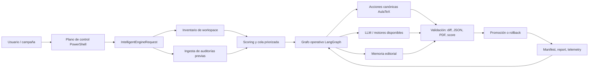
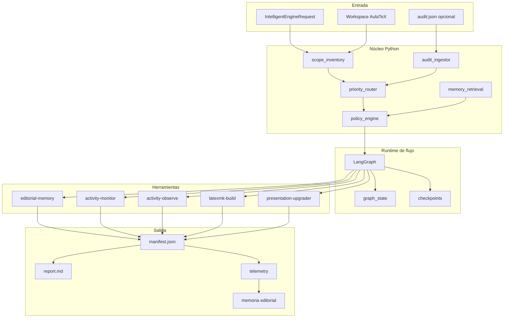
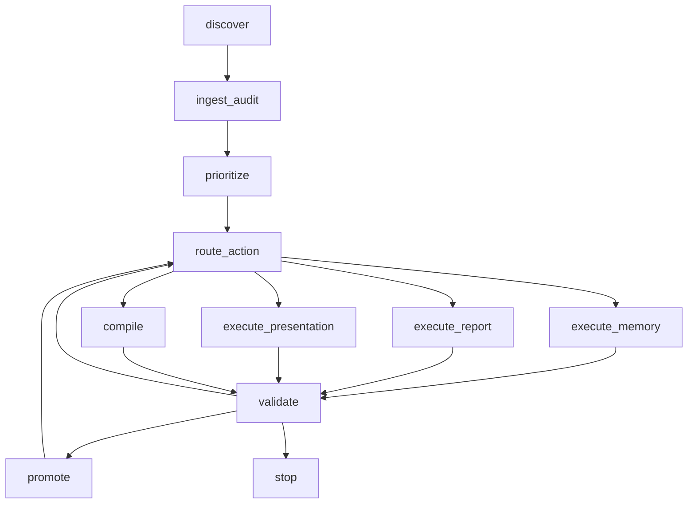

# Motor inteligente AulaTeX v1

## Objetivo

Construir un runtime masivo y reanudable para campañas editoriales sobre el workspace completo, conservando los scripts existentes como acciones canónicas y moviendo la inteligencia de decisión a un motor central.

La premisa de v1 es pragmática:

- PowerShell sigue siendo el plano de control y operación.
- Python concentra el dominio editorial, la priorización y la persistencia.
- LangGraph gobierna los flujos con estado y reintentos acotados.
- DeepAgents queda fuera del núcleo operativo y se reserva para exploración avanzada.

## Arquitectura técnica v1

### Capas

1. Plano de control
   - Runtime: PowerShell.
   - Responsabilidades: campañas, lotes, variables de entorno, compilación, limpieza, publicación de reportes.
   - Artefactos principales: scripts de lote y ciclo ya existentes.

2. Plano del motor
   - Runtime: Python en scripts/aulatex.
   - Responsabilidades: inventario, auditoría, scoring, enrutamiento, manifests, reportes, estado serializable.
   - Punto inicial: scripts/aulatex/intelligent_engine.py.

3. Plano de flujo
   - Runtime: LangGraph como backend preferente.
   - Responsabilidades: nodos, transiciones, checkpoints, retries, reanudación y telemetría por acción.
   - Fallback: backend classic para diagnóstico local y regresiones.

4. Plano de ejecución
   - Responsabilidades: lanzar acciones existentes de AulaTeX y wrappers PowerShell.
   - Acciones canónicas reutilizadas:
     - editorial-memory
     - activity-monitor
     - activity-observe
     - latexmk-build.ps1
     - futuros upgraders genéricos de presentación, reporte, memoria y compilación

### Módulos v1

1. campaign_scheduler
   - Parte campañas grandes en lotes pequeños, reanudables y comparables.

2. scope_inventory
   - Reusa AulaTeXWorkspace para resolver scopes y descubrir TEX/PDF.

3. audit_ingestor
   - Consume audit.json y manifests previos para evitar volver a inspeccionar a ciegas.

4. priority_router
   - Convierte issues en score, score en cola, y cola en acciones.

5. execution_runner
   - En v1 queda planeado; será quien ejecute acciones y actualice estado tras cada paso.

6. validation_gate
   - Separa plan de promoción. No todo parche válido debe promoverse sin compilación, score y frescura del PDF.

7. memory_retrieval
   - Recupera ADN editorial relevante por target, institución, materia y tipo de issue.

8. telemetry_store
   - Persistirá costo, throughput, latencia, éxito por motor y reducción neta de issues.

## Contratos JSON v1

### 1. run manifest

```json
{
  "kind": "intelligent-engine",
  "version": 1,
  "run_id": "20260707-000000-intelligent-engine",
  "request": {
    "target": "<scope-o-carpeta>",
    "backend": "langgraph",
    "max_targets": 12,
    "audit_path": "<ruta-a-audit.json>"
  },
  "scope": {
    "scope_key": "<scope-key>",
    "scope_level": "institucion|carrera|materia|actividad|interinstitucional",
    "target_root": "<scope-o-carpeta>"
  },
  "inventory_summary": {
    "tex_total": 170,
    "planned_targets": 12
  },
  "targets": []
}
```

### 2. target plan

```json
{
  "target": "<scope>/<materia>/reporte-actividad-1.tex",
  "tex_kind": "report",
  "priority_score": 78,
  "issues": [
    {
      "severity": "warning",
      "kind": "reporte-analisis-propio-insuficiente",
      "detail": "Bandera editorial detectada por heuristica local."
    }
  ],
  "recommended_actions": [
    {
      "action_id": "repair-report-editorially",
      "blocking": true,
      "command": [
        ".\\scripts\\aulatex.ps1",
        "activity-monitor",
        "--target",
        "..."
      ]
    }
  ]
}
```

### 3. graph state serializable

```json
{
  "run_id": "string",
  "scope_key": "string",
  "batch_id": "string",
  "queue": [],
  "current_target": "string",
  "current_action": "string",
  "completed": [],
  "failed": [],
  "metrics": {
    "issue_total_before": 0,
    "issue_total_after": 0,
    "pdf_fresh": 0,
    "llm_calls": 0
  },
  "resume_cursor": 0
}
```

## Esquema general del motor



### Lectura del esquema

1. El usuario no le pide al motor que edite todo a ciegas; lanza una campaña con un scope, un presupuesto y un lote máximo.
2. PowerShell prepara el entorno y dispara el comando canónico de AulaTeX.
3. El motor Python convierte la solicitud en inventario, auditoría, cola y acciones sugeridas.
4. LangGraph gobierna la campaña como una máquina de estados: cada target pasa por decisión, acción, validación y promoción.
5. Los LLM no controlan el sistema; funcionan como combustible en nodos concretos, acotados y verificables.
6. Cada ciclo produce manifest, reporte y datos de telemetría para reanudar, comparar y aprender.

## Funcionamiento paso a paso

### 1. Entrada de campaña

El motor recibe una intención operativa:

- target o scope de trabajo;
- auditoría previa opcional;
- backend de flujo;
- límite de targets;
- motores LLM permitidos;
- filtros de reportes, presentaciones o ambos.

Resultado: `IntelligentEngineRequest`.

### 2. Descubrimiento

El motor resuelve el scope con `AulaTeXWorkspace`, recorre archivos `.tex`, detecta reportes/presentaciones y comprueba si existe el PDF correspondiente.

Resultado: inventario normalizado de targets.

### 3. Ingesta de memoria y auditoría

El motor consume artefactos previos cuando existen:

- `audit.json`;
- manifests de corridas anteriores;
- memoria editorial por scope;
- bitácoras y reportes de actividad.

Resultado: issues agrupados por target y contexto editorial disponible.

### 4. Priorización

Cada target recibe un score operativo. El score combina:

- severidad del issue;
- tipo de problema;
- ausencia o desactualización de PDF;
- presencia de placeholders;
- debilidad editorial;
- memoria faltante;
- fallos de compilación.

Resultado: cola priorizada.

### 5. Enrutamiento de acciones

El motor decide la acción mínima útil:

| Condición detectada | Acción sugerida |
| --- | --- |
| Memoria ausente o rota | `editorial-memory` |
| Reporte débil o incompleto | `activity-monitor` |
| Presentación con baja calidad visual | `plan-presentation-upgrade` |
| PDF faltante o viejo | `latexmk-build.ps1` |
| Sin problema crítico | `activity-observe` |

Resultado: `recommended_actions` por target.

### 6. Ejecución controlada

En v1 el motor planifica; en v2 ejecutará con checkpoint. La ejecución debe ser por lotes pequeños:

- un target activo;
- una acción activa;
- timeout explícito;
- rollback si cambia algo inválido;
- manifest actualizado después de cada paso.

Resultado: acción ejecutada o bloqueada con causa explícita.

### 7. Validación

Cada acción se valida con puertas estrictas:

- JSON parseable si hubo salida estructurada;
- diff seguro si hubo patch;
- compilación si aplica;
- PDF fresco;
- score editorial no peor que antes;
- citas/bibliografía consistentes.

Resultado: promover, reintentar, degradar motor o detener.

### 8. Promoción y aprendizaje

Si el resultado pasa validación:

- se marca como acción útil;
- se actualiza manifest;
- se registra telemetría;
- se alimenta memoria editorial;
- se aprende qué ruta funcionó para ese tipo de issue.

Resultado: campaña reanudable y aprendizaje incremental.

## Esquema de componentes internos



## Grafo de estados propuesto



### Reglas de transición

1. discover
   - Descubre TEX, PDF y scope.

2. ingest_audit
   - Fusiona auditoría reciente con inventario local.

3. prioritize
   - Ordena targets por severidad, tipo de issue y valor esperado del siguiente paso.

4. route_action
   - Decide si conviene memoria, revisión, parche de presentación, compilación o solo observación.

5. execute_*
   - Ejecuta acciones canónicas ya existentes. V1 ya planifica esta etapa; v2 la automatiza.

6. validate
   - Verifica artefactos, compilación, score y frescura del PDF.

7. promote
   - Marca la acción como útil y alimenta memoria/telemetría.

8. stop
   - Cierra lote por éxito, budget, bloqueo o rendimiento decreciente.

## Roadmap por fases

### Fase 0

- Ya existe: scripts de lote, ciclos, auditoría y monitor.
- Ya existe: backend LangGraph en activity-monitor.
- Ya existe: instalación canónica LangChain/LangGraph y vía experimental DeepAgents.

### Fase 1

- Agregar planificador inteligente central.
- Persistir manifest y reporte por campaña.
- Consumir audit.json previo.
- Priorizar targets y sugerir acciones canónicas.

### Fase 2

- Ejecutar acciones desde el engine con checkpoints y resume.
- Registrar action_result por target.
- Medir mejora neta real por lote.

### Fase 3

- Recuperación contextual selectiva de ADN editorial.
- Políticas por motor: barato, medio, premium, fallback.
- Promoción automática solo si validación pasa.

### Fase 4

- Optimización por costo/calidad.
- Aprendizaje de rutas más efectivas por tipo de issue.
- Escalado interinstitucional completo.

## Comparativa aplicada: LangGraph vs DeepAgents

### LangGraph

Ventajas en AulaTeX:

1. Modela exactamente el problema real del repo: estados, nodos, rutas, retries y reanudación.
2. Encaja con el backend ya soportado por activity-monitor.
3. Facilita flujos híbridos donde la mayoría de nodos son deterministas y solo algunos invocan LLM.
4. Hace más fácil auditar por qué una acción ocurrió y cuál fue la transición previa.
5. Se adapta bien a campañas masivas con lots pequeños, checkpoints y manifests.

Costes:

1. Exige diseñar bien el estado.
2. Requiere disciplina para no meter lógica de negocio desordenada dentro del grafo.

### DeepAgents

Ventajas en AulaTeX:

1. Útil para exploración abierta, investigación o tareas mal definidas.
2. Conveniente cuando no sabes de antemano cuál será la secuencia de herramientas.

Limitaciones para este caso:

1. El problema principal aquí no es exploración abierta, sino operación editorial reproducible.
2. Cuesta más gobernar costo, reproducibilidad y rutas en campañas masivas.
3. Añade una capa agentic de alto nivel donde el repo ya tiene acciones canónicas claras.
4. No aporta una ventaja decisiva sobre un grafo explícito para auditoría, compilación y promotion gates.

### Decisión recomendada

1. Núcleo operativo: LangGraph.
2. Plano de control: PowerShell.
3. Dominio y persistencia: Python.
4. Uso opcional de DeepAgents: investigación, rediseño de prompts, recuperación de casos raros o experimentación fuera del camino crítico.

## Comando inicial

```powershell
.\scripts\aulatex.ps1 intelligent-engine --target . --audit .\.aulatex-temp\<campaña>\<run>\cycle-01\audit.json --max-targets 8 --backend langgraph
```

También puede acotarse a cualquier institución, carrera, materia o actividad sin que el motor cambie de lógica:

```powershell
.\scripts\aulatex.ps1 intelligent-engine --target .\<institucion>\<carrera>\<materia> --max-targets 8 --backend langgraph
```

Salida esperada:

- manifest.json con arquitectura, contratos, grafo y cola priorizada.
- report.md con resumen operativo legible.

## Criterio de adopción

Conviene adoptar LangGraph como ruta principal porque ya existe evidencia de integración real en AulaTeX y porque el dominio editorial del repo pide control, no improvisación. DeepAgents sí puede convivir, pero como módulo experimental de investigación y no como la columna vertebral del motor.
